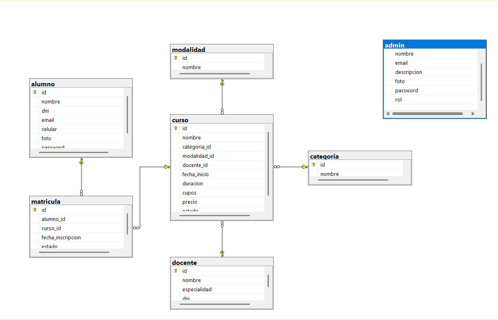

# 📊 CERSA – Sistema de Gestión Académica

Sistema web completo desarrollado en **PHP 8 + MySQL** para la gestión integral de una institución educativa.  
Permite administrar **alumnos, docentes, cursos y matrículas**, generar **reportes dinámicos en PDF**, **tickets de pago**, gestionar **perfiles con fotos** y visualizar **estadísticas en tiempo real**.

---

## 🚀 Funcionalidades Principales

### 🔐 Autenticación y Autorización

- ✅ Sistema de login seguro con hash de contraseñas (`password_hash()` / `password_verify()`)
- ✅ Manejo de sesiones con protección contra Session Fixation
- ✅ **Roles de usuario:** Admin y Alumno
- ✅ **Restricciones de acceso** según rol (sidebar dinámico)
- ✅ Protección CSRF con tokens en formularios sensibles
- ✅ Validación server-side en todas las operaciones
- ✅ Registro de logs para auditoría con `error_log()`
- ✅ Cierre de sesión seguro con destrucción completa de cookies y sesión

**Credenciales de prueba:**

- **Admin:** `giancarlos@cersa.com` / `admin123`
- **Alumno:** `alumno@cersa.com` / `alumno123`

---

### 👨‍🎓 Gestión de Alumnos (CRUD Completo)

- ✅ Crear, editar y eliminar alumnos con validaciones completas
- ✅ **Validaciones server-side:**
  - Nombre (mín. 3 caracteres, máx. 100)
  - DNI (8 dígitos numéricos, único en el sistema)
  - Email (formato válido, único en el sistema)
  - Celular (9 dígitos numéricos)
- ✅ Búsqueda en tiempo real (sin recargar página)
- ✅ Paginación (10 registros por página)
- ✅ Manejo de errores con try-catch
- ✅ Mensajes de error claros y específicos
- ✅ Modal de confirmación para eliminar
- ✅ Reporte general con gráficos
- ✅ Exportación a PDF

---

### 👩‍🏫 Gestión de Docentes

- ✅ Registro y edición de docentes
- ✅ Validaciones completas (DNI único, email válido)
- ✅ Listado general con búsqueda y paginación
- ✅ Relación con cursos (1:N)
- ✅ Reporte PDF institucional

---

### 📚 Gestión de Cursos

- ✅ Administración completa de cursos
- ✅ **Relaciones:**
  - Categoría (Programación, Diseño, Idiomas, Marketing)
  - Modalidad (Virtual en vivo, Video, Presencial)
  - Docente asignado
- ✅ Campos: nombre, precio, cupos, duración, estado
- ✅ Reportes visuales con gráficos
- ✅ Exportación a PDF

---

### 📝 Matrículas (Relación N:M)

- ✅ Registro de matrículas (relaciona Alumnos ↔ Cursos)
- ✅ Estados: _Matriculado_ / _Pendiente_
- ✅ Control por fechas de inscripción
- ✅ Listado con **nombres reales** (no IDs):
  - Muestra nombre del alumno
  - Muestra nombre del curso con precio
- ✅ Reportes y estadísticas
- ✅ Exportación a PDF

---

### 🎫 Generador de Tickets de Pago

- ✅ **Búsqueda de alumnos** por nombre, DNI o email
- ✅ Listado de alumnos con paginación
- ✅ **Modal dinámico** que muestra:
  - Datos del alumno seleccionado
  - Cursos matriculados con modalidad y precio
  - Total a pagar calculado automáticamente
- ✅ **Generación de PDF profesional** con:
  - Logo institucional CERSA
  - Número de ticket único
  - Fecha y hora de emisión
  - Datos completos del alumno
  - Detalle de cursos en tabla
  - Total destacado
  - Código QR para verificación
  - Nota legal al pie

---

### 👤 Gestión de Perfiles con Fotos

- ✅ **Subida de fotos de perfil** (JPG, PNG, GIF)
- ✅ **Validaciones:**
  - Tipo de archivo permitido
  - Tamaño máximo (2MB)
  - Nombres únicos con timestamp
- ✅ **Almacenamiento seguro** en `/img/fotos/`
- ✅ **Campos en BD:** `foto` y `descripcion`
- ✅ Vista previa de foto en perfil
- ✅ Edición de descripción personalizada
- ✅ Fotos circulares en el diseño
- ✅ Diferenciación visual entre roles (Admin / Alumno)

---

## 📈 Dashboard Administrativo

Panel principal con **indicadores dinámicos en tiempo real**:

### 📊 Cards Superiores:

- 📌 Total de alumnos
- 📌 Total de cursos
- 📌 Total de docentes
- 💰 Ganancias totales (S/.)

### 📉 Gráficos Interactivos (Chart.js):

- **Gráfico de líneas:** Ganancias por mes
- **Gráfico de dona:** Ingresos por categoría

> Los gráficos se generan automáticamente con datos reales del sistema.

---

## 📄 Reportes en PDF (FPDF)

Sistema completo de reportes profesionales con:

- ✅ Logo institucional CERSA
- ✅ Usuario que genera el reporte
- ✅ Fecha y hora (zona horaria Perú 🇵🇪)
- ✅ Tablas limpias con encabezados estilizados
- ✅ Sin mostrar IDs internos
- ✅ Diseño institucional y profesional

### Reportes disponibles:

1. 📄 **Reporte General de Alumnos**
2. 📄 **Reporte General de Docentes**
3. 📄 **Reporte General de Cursos**
4. 📄 **Reporte General de Matrículas**
5. 🎫 **Tickets de Pago Individuales**

---

## 🛠️ Tecnologías Utilizadas

### Backend:

- **PHP 8.0+**
- **MySQL / MariaDB**
- **FPDF** (generación de PDFs)

### Frontend:

- **HTML5 / CSS3**
- **JavaScript ES6+**
- **Bootstrap 4**
- **SB Admin 2** (template administrativo)
- **Chart.js** (gráficos dinámicos)
- **jQuery 3.6** (AJAX y manipulación DOM)
- **Font Awesome** (iconos)

### Arquitectura:

- **MVC adaptado** (separación de capas)
- **Consultas preparadas** (prevención SQL Injection)
- **Escape de salida** (prevención XSS)
- **Tokens CSRF** (protección de formularios)

---

## 🗂️ Estructura del Proyecto

```
admin_php/
│
├── actions/                    # Lógica CRUD con validaciones
│   ├── alumnos/
│   │   ├── indexalumno.php    # Listado con búsqueda y paginación
│   │   ├── addalumno.php      # Crear con validaciones server-side
│   │   ├── editaralumno.php   # Editar con validaciones
│   │   ├── deletealumno.php   # Eliminar con confirmación
│   │   └── reportealumno.php  # Reporte con gráficos
│   ├── docentes/
│   ├── cursos/
│   └── matriculas/
│
├── includes/                   # Componentes reutilizables
│   ├── header.php             # <head> y estilos
│   ├── sidebar.php            # Menú lateral dinámico por rol
│   ├── topbar.php             # Barra superior con usuario
│   └── footer.php             # Scripts y cierre
│
├── reportespdf/                # Generación de PDFs con FPDF
│   ├── documentacion.php      # Documentación del sistema
│   ├── reportealumnospdf.php
│   ├── reportedocentespdf.php
│   ├── reportecursospdf.php
│   └── ticketpago.php         # Tickets de pago individuales
│
├── vendor/                     # Librerías externas
│   ├── bootstrap/
│   ├── chart.js/
│   ├── jquery/
│   ├── jquery-ui/             # Autocompletado (no usado finalmente)
│   ├── fontawesome-free/
│   └── fpdf/
│
├── img/                        # Recursos gráficos
│   ├── fotos/                 # Fotos de perfil subidas
│   ├── logo_cersa.png
│   └── undraw_profile.svg
│
├── css/                        # Estilos personalizados
├── js/                         # Scripts personalizados
│
├── db.php                      # Conexión a MySQL
├── index.php                   # Login con validaciones
├── index2.php                  # Dashboard principal
├── generar_tickets.php         # Generador de tickets
├── perfil.php                  # Gestión de perfil con foto
├── logout.php                  # Cierre de sesión seguro
└── README.md                   # Este archivo
```

---

## ⚙️ Instalación y Configuración

### 1️⃣ **Requisitos del Sistema**

- PHP >= 8.0
- MySQL >= 5.7 o MariaDB >= 10.2
- Servidor web (Apache/Nginx)
- Extensiones PHP necesarias:
  - `mysqli`
  - `gd` (para manipulación de imágenes)
  - `mbstring`
  - `json`

### 2️⃣ **Clonar el Repositorio**

```bash
git clone https://github.com/tu-usuario/cersa-sistema-academico.git
cd cersa-sistema-academico
```

### 3️⃣ **Importar la Base de Datos**

1. Abrir **phpMyAdmin**
2. Crear una base de datos:
   ```sql
   CREATE DATABASE proyecto_final CHARACTER SET utf8mb4 COLLATE utf8mb4_unicode_ci;
   ```
3. Importar el archivo `schema.sql` (estructura)
4. Importar el archivo `seed.sql` (datos de prueba)

### 4️⃣ **Configurar la Conexión**

Editar el archivo `db.php`:

```php
<?php
$host = "localhost";
$user = "root";           // Tu usuario de MySQL
$pass = "";               // Tu contraseña de MySQL
$db   = "proyecto_final"; // Nombre de tu base de datos

$conn = new mysqli($host, $user, $pass, $db);

if ($conn->connect_error) {
    die("Error de conexión: " . $conn->connect_error);
}

$conn->set_charset("utf8mb4");
?>
```

### 5️⃣ **Mover el Proyecto**

Colocar la carpeta dentro de:

- **XAMPP:** `C:/xampp/htdocs/`
- **WAMP:** `C:/wamp64/www/`
- **MAMP:** `/Applications/MAMP/htdocs/`

### 6️⃣ **Configurar Permisos (Linux/Mac)**

```bash
chmod 755 admin_php/
chmod 777 admin_php/img/fotos/  # Para subir imágenes
```

### 7️⃣ **Acceder al Sistema**

Abrir en el navegador:

```
http://localhost/admin_php/
```

---

## 👤 Credenciales de Prueba

### **Administrador:**

- **Email:** `giancarlos@cersa.com`
- **Contraseña:** `admin123`
- **Acceso completo:** Alumnos, Cursos, Docentes, Matrículas, Reportes, Tickets

### **Alumno:**

- **Email:** `alumno@cersa.com`
- **Contraseña:** `alumno123`
- **Acceso limitado:** Cursos, Docentes (solo visualización)

---

## 🔐 Características de Seguridad

- ✅ **Hash de contraseñas** con `password_hash()` (bcrypt)
- ✅ **Consultas preparadas** (prevención SQL Injection)
- ✅ **Tokens CSRF** en formularios sensibles
- ✅ **Validación server-side** en todas las operaciones
- ✅ **Escape de salida** con `htmlspecialchars()` (prevención XSS)
- ✅ **Session Regeneration** (prevención Session Fixation)
- ✅ **Logs de auditoría** con `error_log()`
- ✅ **Validación de archivos subidos** (tipo, tamaño, extensión)
- ✅ **Protección de rutas** según rol de usuario

---

## 📊 Diagrama Entidad-Relación



### Descripción de Relaciones:

- **alumno ↔ matricula ↔ curso**: Relación N:M (muchos a muchos)
  - Un alumno puede inscribirse en múltiples cursos
  - Un curso puede tener múltiples alumnos
- **categoria → curso**: Relación 1:N
  - Una categoría agrupa múltiples cursos (Programación, Diseño, Idiomas, Marketing)
- **modalidad → curso**: Relación 1:N
  - Una modalidad aplica a múltiples cursos (Virtual en vivo, Video, Presencial)
- **docente → curso**: Relación 1:N
  - Un docente puede dictar múltiples cursos

### Tablas del Sistema:

- **admin**: Usuarios administradores del sistema
- **alumno**: Estudiantes registrados
- **docente**: Profesores que dictan cursos
- **curso**: Cursos ofrecidos por la institución
- **categoria**: Categorías de cursos
- **modalidad**: Modalidades de enseñanza
- **matricula**: Inscripciones de alumnos en cursos

---

## 📝 Casos de Prueba

### ✅ **Test 1: Login**

1. Ir a `http://localhost/admin_php/`
2. Ingresar credenciales de admin
3. Verificar redirección al dashboard
4. Verificar que aparece "¡Bienvenido, Giancarlos!"

### ✅ **Test 2: Agregar Alumno**

1. Ir a Alumnos → Agregar
2. Llenar formulario con datos válidos
3. Verificar que se guarda correctamente
4. Verificar mensaje de éxito

### ✅ **Test 3: Validación de DNI Duplicado**

1. Intentar agregar alumno con DNI existente
2. Verificar mensaje: "El DNI ya está registrado"

### ✅ **Test 4: Generar Ticket de Pago**

1. Ir a "Generar Tickets"
2. Buscar un alumno (ej: "Karla")
3. Clic en "Ver Cursos"
4. Verificar que muestra los cursos matriculados
5. Clic en "Generar Ticket de Pago"
6. Verificar que se abre el PDF correctamente

### ✅ **Test 5: Subir Foto de Perfil**

1. Ir a Perfil (menú usuario arriba)
2. Clic en "Seleccionar archivo"
3. Elegir imagen JPG < 2MB
4. Clic en "Guardar"
5. Verificar que la foto se muestra en el perfil

### ✅ **Test 6: Roles de Usuario**

1. Iniciar sesión como alumno
2. Verificar que NO aparecen opciones de admin en sidebar
3. Cerrar sesión
4. Iniciar como admin
5. Verificar acceso completo

---

## 🎯 Cumplimiento de Requisitos Académicos

| Requisito                               | Estado             | Evidencia                                         |
| --------------------------------------- | ------------------ | ------------------------------------------------- |
| **1. Autenticación y autorización**     | ✅ 100%            | Login con hash, roles admin/alumno, restricciones |
| **2. CRUD completo**                    | ✅ 100%            | 4 entidades con paginación, relaciones 1:N y N:M  |
| **3. Validación y manejo de errores**   | ✅ 100%            | Server-side, try-catch, mensajes claros           |
| **4. Subida de archivos**               | ✅ 100%            | Fotos de perfil con validación tipo/tamaño        |
| **5. Búsqueda, filtros y ordenamiento** | ✅ 100%            | Búsqueda tiempo real, paginación                  |
| **6. Reportes / Export**                | ✅ 100%            | 5 tipos de PDF con FPDF                           |
| **7. API básica (opcional)**            | ⚠️ No implementado | Opcional según requisitos                         |

---

## 🛠️ Posibles Mejoras Futuras

- 🔄 Recuperación de contraseña por email
- 📊 Más gráficos en el dashboard (barras, áreas)
- 📱 App móvil con API REST
- 🔔 Sistema de notificaciones en tiempo real
- 📧 Envío automático de tickets por email
- 🌐 Multi-idioma (español/inglés)
- 🎨 Tema claro/oscuro
- 📦 Export de reportes en Excel/CSV
- 🔍 Filtros avanzados por fecha, estado, categoría
- 👥 Chat entre alumnos y docentes

---

## 👨‍💻 Autor

**Giancarlos Ormeño**  
Proyecto Final – Desarrollo de Soluciones Web Back-End  
I.E.S.T.P "Gilda Liliana Ballivián Rosado"  
🇵🇪 Perú - 2025

---

## 📄 Licencia

Este proyecto es de uso **educativo y académico**.  
Desarrollado como proyecto final para la asignatura de Desarrollo Web Back-End.

---


## 📞 Contacto

Para consultas sobre este proyecto:

- **Email:** giangio237@gmail.com
- **GitHub:** https://github.com/GiancarlosDev-10

---

**⭐ Si te sirvió este proyecto, no olvides darle una estrella en GitHub ⭐**
